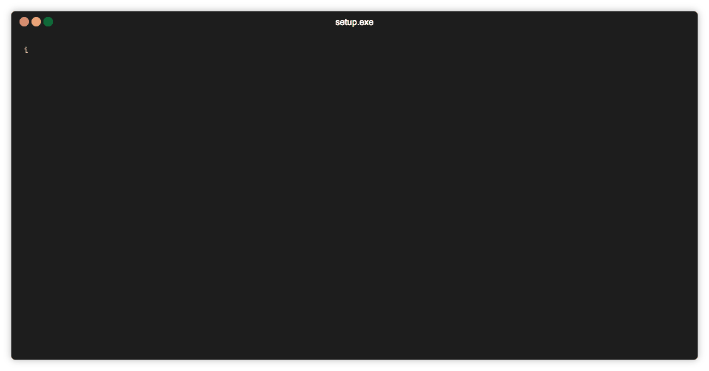

agtardis3d-pankod-cli
==================

<p align="center">
  
</p>

Save a lot of time by generating services, components, tests for Pankod Boilerplate projects

[](https://codeclimate.com/github/pankod/pankod-cli/maintainability)
[](https://codeclimate.com/github/pankod/pankod-cli/test_coverage)
[](https://oclif.io)
[](https://npmjs.org/package/@pankod/pankod-cli)
[](https://npmjs.org/package/@pankod/pankod-cli)
[](https://github.com/Pankod/pankod-cli/blob/master/package.json)

<!-- usage -->
```sh-session
$ npm install -g agtardis3d-pankod-cli
$ agtardis3d-pankod-cli COMMAND
running command...
$ agtardis3d-pankod-cli (-v|--version|version)
agtardis3d-pankod-cli/1.0.8 darwin-x64 node-v14.15.5
$ agtardis3d-pankod-cli --help [COMMAND]
USAGE
  $ agtardis3d-pankod-cli COMMAND
...
```
<!-- usagestop -->
<!-- commands -->
* [`agtardis3d-pankod-cli add Page`](#pankod-cli-add-page)
* [`agtardis3d-pankod-cli help [COMMAND]`](#pankod-cli-help-command)

## `agtardis3d-pankod-cli add Page`

Add services, components and more...

```
USAGE
  $ agtardis3d-pankod-cli add Page
  $ agtardis3d-pankod-cli add Component
  $ agtardis3d-pankod-cli add ClassComponent
  $ agtardis3d-pankod-cli add FunctionalComponent
  $ agtardis3d-pankod-cli add Plugin
  $ agtardis3d-pankod-cli add Repository
  $ agtardis3d-pankod-cli add Service
```

_See code: [src/commands/add/index.ts](https://github.com/Pankod/pankod-cli/blob/v1.0.8/src/commands/add/index.ts)_

## `agtardis3d-pankod-cli help [COMMAND]`

display help for pankod-cli

```
USAGE
  $ agtardis3d-pankod-cli help [COMMAND]

ARGUMENTS
  COMMAND  command to show help for

OPTIONS
  --all  see all commands in CLI
```

_See code: [@oclif/plugin-help](https://github.com/oclif/plugin-help/blob/v2.2.3/src/commands/help.ts)_
<!-- commandsstop -->
# :package: Elements

### `agtardis3d-pankod-cli add <element>`

Add services, components and more...

```sh
  # nextjs2
  $ agtardis3d-pankod-cli add Page
  $ agtardis3d-pankod-cli add Component

  # nextjs
  $ agtardis3d-pankod-cli add Page
  $ agtardis3d-pankod-cli add ClassComponent
  $ agtardis3d-pankod-cli add FunctionalComponent

  # moleculer  
  $ agtardis3d-pankod-cli add Service
  $ agtardis3d-pankod-cli add Repository

  # svelte
  $ agtardis3d-pankod-cli add Component
```

_See code: [src/commands/add](https://github.com/Pankod/pankod-cli/blob/v0.3.3/src/commands/add/index.ts)_
<!-- elementsstop -->
<!-- customization -->
# :building_construction: Customization

[Checkout Wiki](https://github.com/pankod/pankod-cli/wiki) to read about customization and extending the power of your fingers.
<!-- customization -->
